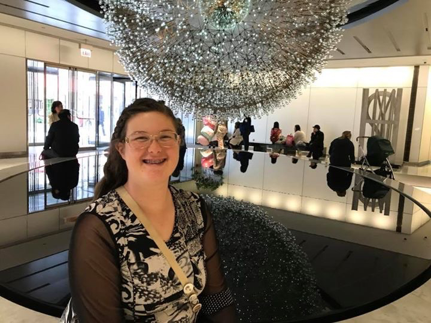

# Pauline's Bat Mitzvah

Updated 7/29

Quick Links for this page (click): [Times of events](#time-line-of-the-celebration) | [Oak Park Temple address/directions](#oak-park-temple) | [Capri Banquets & Catering address/directions](#capri-banquets-catering) | [Drop off/Pick up Info](#drop-off-and-pick-up-information)

> **Saturday, August 18, 2018 (Service 10am-noon, Party 1pm-5pm)**

We are so happy that you may come to Pauline's celebration and we can't wait to see you! This web site has information about Pauline's Bat Mitzvah celebration. 

If you have a question that is not answered here, do not hesitate to contact us at `info@paulinebatmitzvah.com`

## Time line of the celebration

Here is what is happening. All events begin <b>promptly</b> at the start time indicated. 

| Who   | What   | When    | Where   |
|:-------|:------|:--------|:--------|
| Out of town guests |  Friday night dinner   (Chicago Style Pizza) | Friday 8/17   6:30pm | Oak Park Temple |
| Out of town guests and anyone else who wants to come| Friday night service | Friday 8/17   8pm-9:30pm | Oak Park Temple | 
| Everyone | Bat Mitzvah Service | Saturday 8/18   Starts 10am, Ends around noon | Oak Park Temple | 
| Everyone | Luncheon and Party | Saturday 8/18   Starts 1pm, Ends no later than 5pm | Capri Banquets & Catering, Countryside | 
| Out of town guests | Informal get together and hot dog bar | Saturday 8/18    (after the party) 5-10pm  | Our house in Willowbrook   
| Out of town guests | Tour of Fermilab | Sunday 8/19   Meet at our house at 9am  | Closed-toe flat shoes are <u>required</u> for the tour (no sandals)| 
| Out of town guests | Dinner at Greek Islands  | Sunday 8/19   6:30pm | Greek Islands, 300 E 22nd St, Lombard, IL 60148 | 
| Out of town guests | Visit & Tour of Shedd Aquarium | Monday 8/20   Meet at Shedd Aquarium accessible entrance at 9am (leave hotel at 8am)  | Shedd Aquarium, 1200 S. Lake Shore Drive, Chicago, IL 60527 |

### Locations of events

#### Oak Park Temple

`1235 Harlem Ave, Oak Park, IL 60302`. Phone: `(708) 386-3937`. Also see https://oakparktemple.com . Oak Park Temple is on the right side of Harlem Ave. just past Division St.  Drop off is directly in front of the temple on Harlem Ave. or on the north side on Berkshire St., just past the building. There is a very small parking lot off of Harlem just before the temple building (the next driveway after the gas station and Division St). If full, turn left at the end of the lot and proceed down the alley (watch for pedestrians at the sidewalk) and turn right onto Berkshire St. Then street park. Alternatively, pass the small parking lot on Harlem and turn right just past the temple building onto Berkshire St. Then street park. There are no parking restrictions other than those indicated by signage. 
- [Map](https://www.google.com/maps/place/Oak+Park+Temple/@41.9027412,-87.8071949,17z/data=!3m1!4b1!4m5!3m4!1s0x880fcb321af07a6b:0xb064a1520bd6d3fb!8m2!3d41.9027372!4d-87.8050062)
- [Directions](https://www.google.com/maps/dir/Best+Western+Plus+Chicagoland+-+Countryside,+Joliet+Road,+Countryside,+IL/Oak+Park+Temple,+1235+Harlem+Ave,+Oak+Park,+IL+60302/@41.8397401,-87.9136227,12z/data=!3m1!4b1!4m16!4m15!1m5!1m1!1s0x880e4835b8d4f883:0x5e6eedb10146be0b!2m2!1d-87.8730132!2d41.777754!1m5!1m1!1s0x880fcb321af07a6b:0xb064a1520bd6d3fb!2m2!1d-87.8050062!2d41.9027372!2m1!2b1!3e0) from Best Western Plus to Oak Park Temple (no tolls)
- [Directions](https://www.google.com/maps/dir/Crowne+Plaza+Chicago+SW+-+Burr+Ridge,+S+Frontage+Road,+Burr+Ridge,+IL/Oak+Park+Temple,+1235+Harlem+Ave,+Oak+Park,+IL+60302/@41.8246462,-87.9511171,12z/data=!3m1!4b1!4m16!4m15!1m5!1m1!1s0x880e48babe2fc1f3:0x5e66b2dbb4a574e3!2m2!1d-87.9215302!2d41.7534609!1m5!1m1!1s0x880fcb321af07a6b:0xb064a1520bd6d3fb!2m2!1d-87.8050062!2d41.9027372!2m1!2b1!3e0) from Crowne Plaza to Oak Park Temple (no tolls)

#### Capri Banquets & Catering

`6240 Joliet Rd, Countryside, IL 60525`. Phone: `(708) 571-1000`. Also see http://capribanquets.com/about.html . The hall has a very large parking lot. 
- [Map](https://www.google.com/maps/place/Capri+Banquets+%26+Catering/@41.776221,-87.8742897,17z/data=!3m1!4b1!4m5!3m4!1s0x880e48342cbf4e25:0x8d23463c294df84d!8m2!3d41.776217!4d-87.872101)
- [Directions](https://www.google.com/maps/dir/Oak+Park+Temple,+Harlem+Avenue,+Oak+Park,+IL/Capri+Banquets+%26+Catering,+6240+Joliet+Rd,+Countryside,+IL+60525/@41.8327431,-87.9074904,12z/data=!3m1!4b1!4m16!4m15!1m5!1m1!1s0x880fcb321af07a6b:0xb064a1520bd6d3fb!2m2!1d-87.8050062!2d41.9027372!1m5!1m1!1s0x880e48342cbf4e25:0x8d23463c294df84d!2m2!1d-87.872101!2d41.776217!2m1!2b1!3e0) **from Oak Park Temple** to Capri (no tolls)
- [Directions](https://www.google.com/maps/dir/Capri+Banquets+%26+Catering,+6240+Joliet+Rd,+Countryside,+IL+60525/Crowne+Plaza+Chicago+SW+-+Burr+Ridge,+S+Frontage+Road,+Burr+Ridge,+IL/@41.7612081,-87.9143252,14z/data=!3m1!4b1!4m16!4m15!1m5!1m1!1s0x880e48342cbf4e25:0x8d23463c294df84d!2m2!1d-87.872101!2d41.776217!1m5!1m1!1s0x880e48babe2fc1f3:0x5e66b2dbb4a574e3!2m2!1d-87.9215302!2d41.7534609!2m1!2b1!3e0) from Capri back to Crowne Plaza (no tolls)
- [Directions](https://www.google.com/maps/dir/Capri+Banquets+%26+Catering,+6240+Joliet+Rd,+Countryside,+IL+60525/Best+Western+Plus+Chicagoland+-+Countryside,+Joliet+Road,+Countryside,+IL/@41.7769895,-87.8747458,17z/data=!3m1!4b1!4m16!4m15!1m5!1m1!1s0x880e48342cbf4e25:0x8d23463c294df84d!2m2!1d-87.872101!2d41.776217!1m5!1m1!1s0x880e4835b8d4f883:0x5e6eedb10146be0b!2m2!1d-87.8730132!2d41.777754!2m1!2b1!3e0) from Capri back to Best Western Plus (almost across the street)

### When should I arrive Saturday morning at Oak Park Temple?

Please arrive or drop off your child at Oak Park Temple no later than 9:45am. Note that this weekend is the Chicago Air and Water show. There will be about a million people (really!) at the Chicago lakefront each day for the show, so tollway/expressway traffic may be heavier than for a usual Saturday morning. With no traffic, it takes us 30 minutes to drive from our house in Willowbrook to Oak Park Temple. That travel time doubles in heavy traffic. A phone app with accurate traffic information, like Waze, is very helpful. Check your arrival time well in advance to see if you have to leave earlier than you anticipated. That being said, if you end up arriving late then enter the sanctuary and find a seat quietly. We'll be glad that you made it. 

Driving from Oak Park Temple to Capri Banquets & Catering in Countryside should take about 20-30 minutes. 

Note that I may send out an e-mail to those who are coming from particular areas (e.g. near Fermilab; near Cass Jr. High) to facilitate car pooling. If you'd rather I not include you, then let me know before August 1. 

### Drop off and pick up information

<B>Note that drop off and pick up are in different towns!</B> Please drop off your child at Oak Park Temple (1235 Harlem Ave, Oak Park) no later than 9:45am Saturday morning. To make things easier, we can drive unaccompanied children from services at Oak Park to the luncheon/party in Countryside with their parent’s permission. If you would prefer to drive your own child between the venues, please pick up your child at 12:15pm at Oak Park Temple and drive them to Capri Banquets & Catering (6240 Joliet Road, Countryside). When the party is over, please pick up your child at Capri Banquets & Catering in Countryside <b>no later than 5pm</b>. Note that I may send out an e-mail to those who are coming from particular areas (e.g. near Fermilab; near Cass Jr. High) to facilitate car-pooling. If you’d rather I not include you, then let me know before August 1.

### Will I be fed?

YES! Directly after the Saturday morning service at the temple vegetarian and dairy appetizers and snacks as well as non-alcoholic drinks will be provided. Following that there will be a full Italian luncheon buffet and a selection of alcoholic and non-alcoholic drinks at the banquet hall. (The caterer owns the excellent Capri Restaurant (Italian food) in Burr Ridge). We promise you will not go hungry!

Please let us know ahead of time if you have any dietary restrictions.

### What will be at the party?

Food and fun! A DJ will be spinning the tunes for fun and dancing. The hall is very large with an area outdoors, so chatting should be easy if you are not dancing. 

Problems or more questions, send us e-mail at `info@paulinebatmitzvah.com` 
